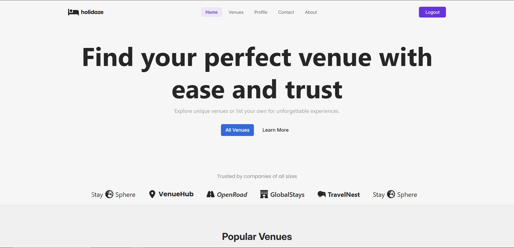

###### Holidaze: Project Exam 2

### Introduction
Welcome to Holidaze, the final project for my Front-End Development studies at Noroff! This application is an Airbnb-inspired platform designed to simplify venue management and bookings for travelers and venue managers alike. Holidaze offers an intuitive and user-friendly interface, built with modern front-end technologies, to enhance the experience of both travelers and hosts.

## Screenshot



### Features
- User Registration & Authentication: Create an account or log in to access personalized features.
- Browse & Search Venues: Explore various venues with detailed information and images.
- Add & Manage Venues: Venue managers can list new venues and manage existing ones.
- Booking System: Seamlessly book your favorite venues with just a few clicks.
- User Profile Management: Update personal details, view booking history, and manage your venues.
- My Venues & My Bookings: Easily access your listed venues or upcoming reservations in dedicated sections.

### Technologies Used
- **React**: Core framework for building the user interface.
- **React-Router-dom**: For routing between different pages of the app.
- **React-hook-form**: Simplified form handling and validation.
- **React-icons**: Icon library used for adding scalable vector icons.
- **Yup**: Schema validation for forms.
- **Tailwind CSS**: Utility-first CSS framework for styling
- **Vite**: Development server and build tool for fast project setup.
- **TypeScript**: Adds static typing to JavaScript, enhancing code quality and maintainability.
- **TanStack React Query**: For managing, caching, and synchronizing server state in React applications.
- **Axios**: HTTP client for making API requests.
- **Framer Motion**: Animation library for creating smooth, interactive animations.
- **React-Calendar**: Component for displaying and selecting dates in a calendar view.
- **React-Intersection-Observer**: Hook for observing element visibility, useful for lazy loading or triggering animations.
- **React-Use-Measure**: Hook to measure the dimensions of DOM elements for responsive or dynamic layouts.

[](https://skillicons.dev)

### Installation
## Installation
1. Clone the repository:
   ```bash
   git clone https://github.com/your-username/your-repo-name.git

2. Navigate to the project directory:
   ```bash
   cd your-repo-name

3. Install Dependencies:
   ```bash
   npm install

4. Set Up Environment Variables:
    1. Create a .env file in the root of the project.
    2. Add the necessary environment variables. For example:
     ```bash
       VITE_API_BASE_URL=https://your-api-url.com
     ```
     3. Ensure that .env is added to .gitignore to avoid comitting it to version control.

6. Run the Development Server:
   ```bash
   npm run dev

## Usage
- After starting the development server, navigate to `http://localhost:3000` to see the Holidaze application.
- Register an account, browse through venues, create bookings, manage venues and change your profile settings.

### Contributing
Contributions are welcome! Please feel free to submit a Pull Request or open an issue if you find any bugs or improvements.

## Contact
Created by [Karl Petter Nordgaard](https://github.com/karlpnord) - feel free to reach out!
